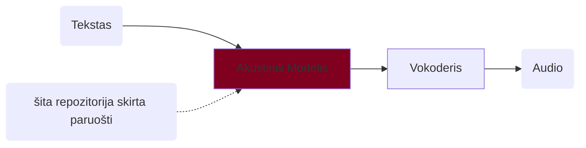
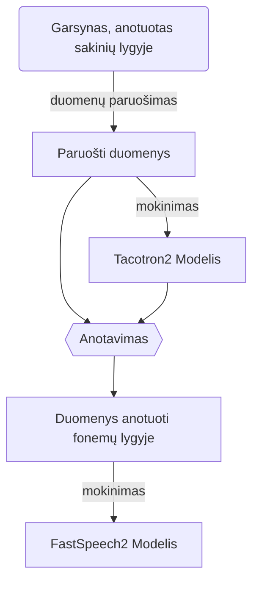

# SEG (Sintezės emocinis garsynas) skriptai

### Turinys
- [SEG (Sintezės emocinis garsynas) skriptai](#seg-sintezės-emocinis-garsynas-skriptai)
    - [Turinys](#turinys)
    - [Apie](#apie)
    - [Reikalavimai](#reikalavimai)
    - [Instaliavimas](#instaliavimas)
    - [Mokinimas SEG](#mokinimas-seg)
    - [Mokinimas su kitu garsynu](#mokinimas-su-kitu-garsynu)

### Apie

Ši repositorija yra kopija iš: https://github.com/espnet/espnet. Repositorija skirta įvairiems šnekos sintezės, atpažinimo, vertimo ir kitoms kalbos technologijų problemoms spręsti. Pilna paketo informacija [čia](https://espnet.github.io/espnet/).

Šioje direktorijoje yra paruošti skriptai, kurie palengvina akustinio modelio, skirto šnekos sintezei, sukūrimą. Akustinis modelis generuoja mel-spektogramas iš teksto. Žemiau pateikta bendra šnekos sintezės schema ir šios repozitorijos paskirtis joje:



Šioje repozitorijoje atlikti tokie pakeitimai:
  1. Kodas pakoreguotas, kad būtų galima naudoto G2P (grapheme to phoneme) modelį lietuvių kalbai. Prijungta https://github.com/espeak-ng/espeak-ng biblioteka. Ši biblioteka neapima visų lietuvių kalbos ypatybių, bet kol kas yra vienintelis laisvai prieinamas G2P modelis lietuvių kalbai.
  2. Paruošti skriptai, kurie automatizuoja, supaprastina FastSpeech2 akustinio modelio mokinimą paruošimą, pritainakant jį SE Garsynui.

FastSpeech2  modelio kūrimui reikalingas garsynas anuotuotas fonemų lygyje. Kadangi SEG neturi tokios anotacijos, tai mes pirmiausia apmokiname Tacotron2 Akustinį modelį. Tada juo naudodamiesi padarome duomenų anotavimą fonmų lygyje. Ir toliau jau mokiname galutinį FastSpeech2 modelį. Detali FastSpeech2 modelio mokinimo schema: 


### Reikalavimai

| | | |
|-|-|-|
| OS | Linux (Debian, Ubuntu) | Skriptai veikia Linux OS (išbandyta Ubuntu, Debian, bet turėtų veikti ir kitose distribucijose). Windows mašinoje galima mokinti naudojant WSL. |
| RAM | >32Gb | |
| HDD | >70Gb | |
| GPU | >=10Gb | |
| CUDA | CUDA11 *arba* CUDA12 | |
| Programos, bibliotekos | git, make, conda, libsndfile, espeak-ng | |


### Instaliavimas

```bash
## diegiame reikalingus įrankius bibliotekas
sudo apt install git make libsndfile-dev espeak-ng
### parsisiunčiame šią repozitoriją
git clone https://github.com/airenas/espnet.git
cd espnet
### pasiruošiame python 3.12 aplinką
conda create -n espnet python=3.12
conda activate espnet
### instaliuojame
pip install -e .[tts] 
### instaliuojame papidomas bibliotekas
pip install phonemizer resampy
```

Patikriname ar GPU randamas sukurtoje python aplinkoje, ar driveris užkraunamas:
```bash
### patikriname 
cd egs2/seg/tts1
make info
```
Jei viskas gerai, turėtume matyti:
```txt
....
cuda in python: 	12.x (arba 11.x)
```

### Mokinimas SEG

1. Parsisiunčiame garsyną zip formatu: *nuoroda bus pateikta...*.
2. Pasiruošiame `make` konfigūracinį failą : `Makefile.options` šioje direktorijoje.
   
   Nurodome:
   1. kelią iki garsyno zip failo
   2. kalbėtoją. Pvz. nurodome kalbėtojo vardą, ar sutrumpinimą.
   3. kalbėtojo pagrindinio tono rėžius. Juos nurodžius bus tiksliau nustatomas pagrindinis tonas. SE Garsyne ši informacija yra nurodyta README faile. Jei rėžių nežinote, nustatykite fmin=50, fmax=625.
   4. darbinę direktoriją (work_dir). Joje bus saugomi tarpiniai duomenys ir galutinis modelis.

   `Makefile.options` pavyzdys:
   ```make
    ## garsynas
    corpus_file?=/home/user/corpus/AGN-1.0.zip
    ### kalbėtojo duomenys, pagrindinio tono rėžiai
    speaker?=agn
    f0min?=150
    f0max?=625
    ### darbo katalogas
    work_dir?=agn-01
   ```
3. Patikriname konfigūraciją
   Vykdome komandą `make info`. Resultato pvz.:
   ```txt
    f0min: 			150 
    f0max: 			625
    corpus_file: 	/home/user/corpus/AGN-1.0.zip
    work_dir: 		agn-01
    speaker: 		agn
    dev_count: 		250
    nvidia-smi: 		NVIDIA RTX 4000 Ada Generation, 20475 MiB, 580.126.09
    cuda visible dev: 	
    python: 			Python 3.12.12
    torch: 			2.10.0+cu128
    cuda in python: 	12.8
   ```
   Patikriname ar garsyno failas ir darbinė direktorija teisinga.
   Patikriname ar GPU inicializuojamas teisingai python aplinkoje. `cuda in python: ` turi rodyti versijos numerį.
4. Mokiname
   ```bash
   make build
   ## arba 
   nohup make build &
   ```
   Modelis bus apmokintas, išsaugotas ir paruoštas `${work_dir}/` kataloge.
   Mokinimo progresas matomas terminalo lange. Jei leidžiama su `nohup`, tada matomas `nohup.out` faile. Pvz.: `tail - f nohup.out`. 

Preliminarūs mokinimo laikai su SE Garsyno vienu kalbėtoju (18h)
| GPU | Laikas |
| -- | --- |
| GeForce GTX 1080 Ti, 11178 MiB | apie 5 dienas |
| NVIDIA RTX 4000 Ada Generation, 20475 MiB | apie 3,5 dienas  |

### Mokinimas su kitu garsynu

1. Padėkite audio failus `${work_dir}/downloads/corpus/wavs`. Failų formatas turi būti mono PCM WAV. Vienas sakinys turi būti viename faile.
2. Padėkite transkripciją `${work_dir}/downloads/corpus/metadata.csv`. Trankripcijos formatas `Failo pavadinimas (be .wav iįplėtimo) wavs kataloge | Transkripcija (UTF-8) | Normalizuota (skačiai paversti žodžiais) transkripcija (UTF-8)`.
3. Pažymėkite, kad garsynas paruoštas: `touch ${work_dir}/downloads/corpus/.done`
4. Tęskite mokinimą kaip [Mokinimas SEG](#mokinimas-seg). Konfigūracijoje `kelias iki garsyno` (`corpus_file`) bus nenaudojamas.
