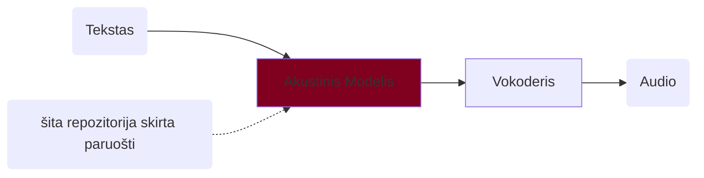
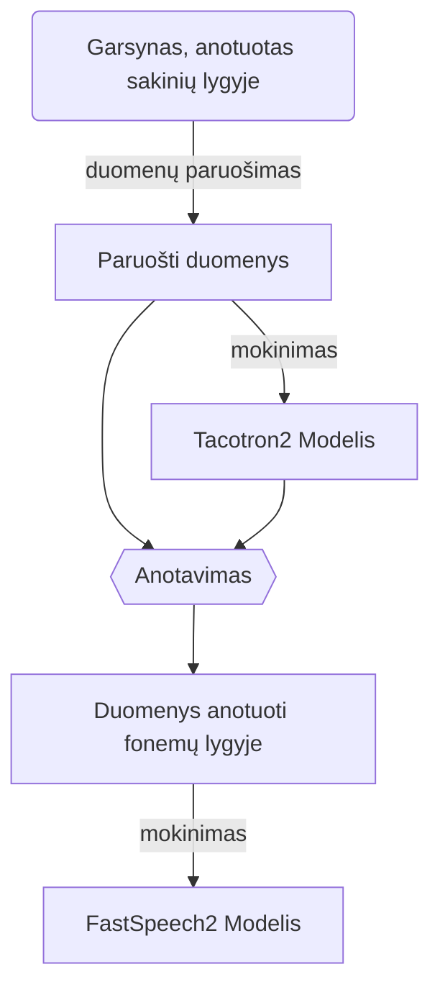

# SEG (Sintezės emocinis garsynas) skriptai

Nuoroda į garsyną: *TBD (bus papildyta vėliau)*

### Turinys
- [SEG (Sintezės emocinis garsynas) skriptai](#seg-sintezės-emocinis-garsynas-skriptai)
    - [Turinys](#turinys)
    - [Apie](#apie)
    - [Reikalavimai](#reikalavimai)
    - [ESPnet diegimas](#espnet-diegimas)
    - [Mokymas](#mokymas)
      - [SE Garsynas](#se-garsynas)
      - [Su kitu garsynu](#su-kitu-garsynu)
    - [Sintezavimas](#sintezavimas)
      - [Paruošti modeliai](#paruošti-modeliai)
      - [Lokaliame kompiuteryje](#lokaliame-kompiuteryje)
        - [Sintežės paleidimas lokaliai](#sintežės-paleidimas-lokaliai)

### Apie

Ši repozitorija yra kopija (fork) iš: https://github.com/espnet/espnet. Repozitorija skirta įvairių kalbos technologijų uždavinių (šnekos sintezės, atpažinimo, vertimo ir kitų) sprendimui. Pilna paketo dokumentacija [čia](https://espnet.github.io/espnet/).

Išbandyti lietuviškus sintezės balsus galite naudodami jau [paruoštus modelius](#paruošti-modeliai)

Šioje direktorijoje yra paruošti skriptai, kurie palengvina akustinio modelio, skirto šnekos sintezei, sukūrimą. Akustinis modelis generuoja mel-spektogramas iš teksto. Žemiau pateikta bendra šnekos sintezės schema ir šios repozitorijos paskirtis joje:



Šioje repozitorijoje atlikti tokie pakeitimai:

    1. Kodas pakoreguotas, kad būtų galima naudoti G2P (grapheme to phoneme) modelį lietuvių kalbai. Prijungta https://github.com/espeak-ng/espeak-ng biblioteka. Ši biblioteka neapima visų lietuvių kalbos ypatybių, bet kol kas yra vienintelis laisvai prieinamas G2P modelis lietuvių kalbai.
   
    2. Paruošti skriptai, kurie automatizuoja ir supaprastina FastSpeech2 akustinio modelio paruošimą, pritaikant jį SE garsynui.

FastSpeech2 modelio kūrimui reikalingas garsynas, kuris būtų anotuotas fonemomis. Kadangi SEG neturi tokios anotacijos, pirmiausia apmokome Tacotron2 akustinį modelį. Tada, juo naudodamiesi, atliekame duomenų anotavimą fonemų lygiu. Toliau mokome galutinį FastSpeech2 modelį. Detali FastSpeech2 modelio mokymo schema:


### Reikalavimai

| | | |
|-|-|-|
| OS | Linux (Debian, Ubuntu) | Skriptai veikia Linux OS (išbandyta Ubuntu, Debian, bet turėtų veikti ir kitose distribucijose). Windows mašinoje galima mokinti naudojant WSL. |
| RAM | >32 GB | |
| HDD | >70 GB | |
| GPU | >=10 GB | |
| CUDA | CUDA11 *arba* CUDA12 | |
| Programos, bibliotekos | git, make, conda, libsndfile, espeak-ng, zip | |


### ESPnet diegimas

```bash
## diegiame reikalingus įrankius ir bibliotekas
## pvz Debian
sudo apt install git make libsndfile-dev espeak-ng zip
### parsisiunčiame šią repozitoriją
git clone https://github.com/airenas/espnet.git
cd espnet
### pasiruošiame python 3.12 aplinką
conda create -n espnet python=3.12
conda activate espnet
### instaliuojame espnet
pip install -e .[tts] 
### instaliuojame papildomas bibliotekas
pip install phonemizer resampy
```

Patikriname, ar GPU randamas sukurtoje python aplinkoje, ar tvarkyklė užkraunama:

```bash
### patikriname 
cd egs2/seg/tts1
make info
```

Jei viskas gerai, turėtume matyti:

```txt
....
cuda in python: 	12.x (arba 11.x)
```

### Mokymas

#### SE Garsynas

1. Parsisiunčiame garsyną vienam kalbėtojui zip formatu: *TBD*.
2. Pasiruošiame `make` konfigūracinį failą `Makefile.options` šioje direktorijoje.
   
   Nurodome:
   1. kelią iki garsyno zip failo
   2. kalbėtoją. Pvz. nurodome kalbėtojo vardą, ar sutrumpinimą.
   3. kalbėtojo pagrindinio tono rėžius. Juos nurodžius bus tiksliau nustatomas pagrindinis tonas. SE Garsyne ši informacija yra nurodyta README faile. Jei rėžių nežinote, nustatykite fmin=50, fmax=625.
   4. darbinę direktoriją (work_dir). Joje bus saugomi tarpiniai duomenys ir galutinis modelis.

   `Makefile.options` pavyzdys:
   ```make
    ## garsynas
    corpus_file?=/home/user/corpus/AGN-1.0.zip
    ### kalbėtojo duomenys, pagrindinio tono rėžiai
    speaker?=agn
    f0min?=150
    f0max?=625
    ### darbo katalogas
    work_dir?=agn-01
   ```
3. Patikriname konfigūraciją. Vykdome komandą `make info`. Rezultato pavyzdys:
   ```txt
    f0min: 			150 
    f0max: 			625
    corpus_file: 	/home/user/corpus/AGN-1.0.zip
    work_dir: 		agn-01
    speaker: 		agn
    dev_count: 		250
    nvidia-smi: 		NVIDIA RTX 4000 Ada Generation, 20475 MiB, 580.126.09
    cuda visible dev: 	
    python: 			Python 3.12.12
    torch: 			2.10.0+cu128
    cuda in python: 	12.8
   ```
   Patikriname ar garsyno failas ir darbinė direktorija teisinga. Patikriname ar GPU inicializuojamas teisingai python aplinkoje. `cuda in python` turi rodyti versijos numerį.
4. Mokome
   ```bash
   make build
   ## arba, kad mokymas nenutrūktų uždarius terminalo langą
   nohup make build &
   ```
    Modelis bus apmokytas, išsaugotas ir paruoštas `${work_dir}/ exp/tts_train_fastspeech2_raw_phn_espeak_ng_lt/tts_train_fastspeech2_raw_phn_espeak_ng_lt_train.loss.ave.zip` kataloge.
    Mokymo progresas matomas terminalo lange. Jei paleidžiama su `nohup`, tada progresas matomas `nohup.out` faile. Pvz.: `tail -f nohup.out`.

Preliminarūs mokymo laikai su vienu SE garsyno kalbėtoju (18h)
| GPU | Laikas |
| -- | --- |
| GeForce GTX 1080 Ti, 11178 MiB | apie 6 dienas |
| NVIDIA RTX 4000 Ada Generation, 20475 MiB | apie 4 dienas  |

#### Su kitu garsynu

1. Patalpinkite audio failus `${work_dir}/downloads/corpus/wavs`. Failų formatas turi būti mono PCM WAV. Vienas sakinys turi būti viename faile.
2. Paruoškite transkripcijos failą `${work_dir}/downloads/corpus/metadata.csv`. Transkripcijos failo formatas: kiekvienoje eilutėje 3 laukai, atskirti `|` simboliu. Laukų reikšmės: `Failo pavadinimas (be .wav išplėtimo) wavs kataloge | Transkripcija (UTF-8) | Normalizuota (skaičiai paversti žodžiais) transkripcija (UTF-8)`. Pvz.:
```csv
00007600-d7ba-41a5-bf11-6369fe31bbbe|Žmonės patirs nuoskriaudą.|Žmonės patirs nuoskriaudą.
0000b912-b69e-4919-b581-e047aa60dd82|Pažvelk į mano planetą.|Pažvelk į mano planetą.
00091cf8-3ed8-4400-9729-ed36aa25c692|Krūmai.|Krūmai.
```
3. Pažymėkite, kad garsynas paruoštas: `touch ${work_dir}/downloads/corpus/.done`. Garsyno katalogo struktūros pavyzdys:
```tree
wrk-01
└── downloads
    └── corpus
        ├── .done
        ├── metadata.csv
        └── wavs
            ├── 00007600-d7ba-41a5-bf11-6369fe31bbbe.wav
            ├── 0000b912-b69e-4919-b581-e047aa60dd82.wav
            ├── 00018c30-6e45-4039-b5d6-ab1de5ce861e.wav
            ├──             ...
```
4. Tęskite mokymą kaip [SE Garsynas](#se-garsynas). Konfigūracijoje `kelias iki garsyno` (`corpus_file`) bus nenaudojamas.


### Sintezavimas

Čia pateikiame pavyzdžius kaip naudojant ESPnet galima sintezuoti lietuvišką tekstą.

#### Paruošti modeliai

Viešai prieinami akustiniai modeliai ir vokoderiai:
1. AM - TBD
2. AM - TBD
3. Vokoderis - TBD
4. Vokoderis - TBD

Pavyzdinis sintezavimo jupyter failas: [tts_jupyter_demo.ipynb](tts_jupyter_demo.ipynb).
Colab: TBD

#### Lokaliame kompiuteryje

Sintezuoti galite naudodami šios repozitorijos kodą Python aplinkoje. Jums reikės:

1. Akustinio modelio. Jį galite:    
   1.  mokinti [SE Garsynas](#se-garsynas) 
   2.  arba atsisiųsti iš [Paruošti modeliai](#paruošti-modeliai).
2. Vokoderio. Galite naudoti:
   1. suprogramuotą Griffin-Lim - prastesnė garso kokybė
   2. mokinti [TBD](TBD) - aukšta garso kokybė
   3. atsisisiųsti iš [Paruošti modeliai](#paruošti-modeliai)  - aukšta garso kokybė.
   
Pavyzdinis jupyter failas: [tts_jupyter_demo_local.ipynb](tts_jupyter_demo_local.ipynb). 

##### Sintežės paleidimas lokaliai

1. Sudiekite [ESPnet](#espnet-diegimas)
2. Papildomai espnet conda aplinkoje įdiekite `pip install parallel_wavegan jupyter --no-build-isolation`
3. Paleiskite jupyter `jupyter notebook` ir atsidarykite failą  'tts_jupyter_demo_local.ipynb' naršyklėje.
   